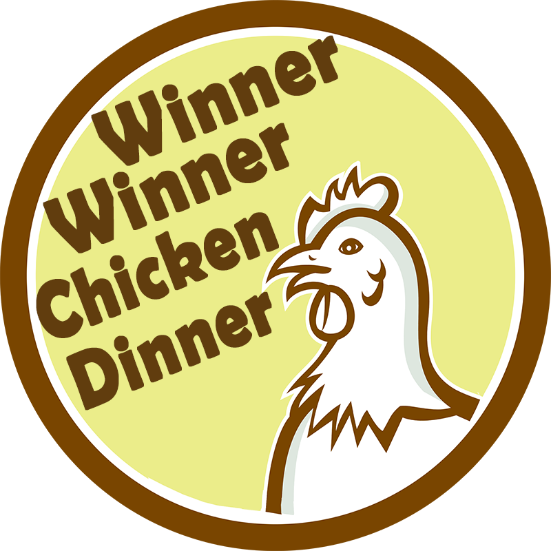

# Chiggen Chase

Here I created a basic race game where Homer Simpson and Peter Griffin compete to catch the chicken first! Feel free to fork / star / watch for your own personal use.

See the published project at [Chiggen Chase](https://serabakpak.github.io/chiggen-chase "Chiggen Chase").

## Technologies Used
- jQuery and JavaScript to make game logic
- CSS to style the game
- Vendor CSS library (animate.css) to add class-based animations
- HTML for basic structure of the game

## Code I'm Proud Of

First, I set the width of the track to be the document width minus the chicken's width so the chicken would stop moving before the end of the page. Then, to determine the winner, I determined the position of each player using .position(). This grabs the position of the left edge of the player so I had to add the width of the player to determine the position of the right edge. Then the first player whose position would reach the track's width would be deemed the winner.

```javascript    
    var chickenWidth = $('#chicken').width();
    var trackWidth = $(document).width() - chickenWidth;
    
    ...

    //check for winner
    var positionOne = $($homerSimpson).position();
    var positionTwo = $($peterGriffin).position();
    
    if (positionOne.left + $($homerSimpson).width() >= trackWidth) {
        $(document).off('keydown');
        $('#container').append('</img>');
        $('h1').text('Homer Simpson Wins!!!!');
        var audio = new Audio('media/burp.wav');
        audio.play();
        $('#reset').addClass('animated infinite pulse');
        return;
    }
    if (positionTwo.left + $($peterGriffin).width() >= trackWidth) {
        $(document).off('keydown');
        $('#container').append('</img>');
        $('h1').text('Peter Griffin Wins!!!!');
        var audio = new Audio('media/laugh.mp3');
        audio.play();
        $('#reset').addClass('animated infinite pulse');
        return;
    }
```
## Screen Shots

